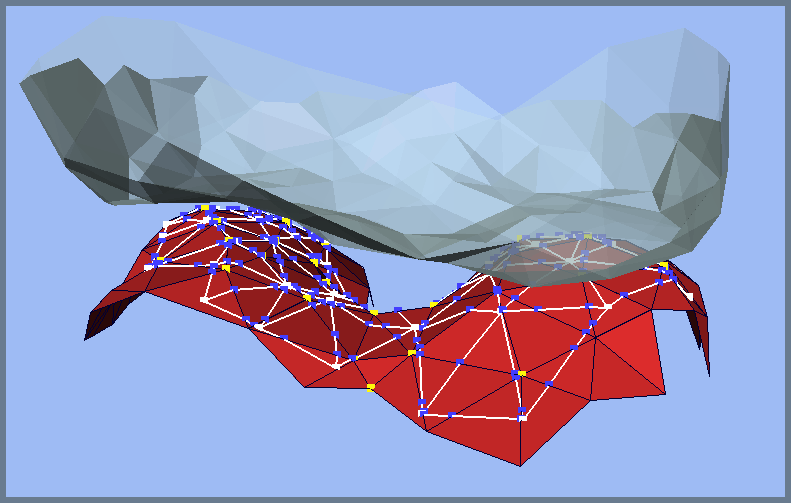

The psurface library
====================

Psurface is a C++ library that handles piecewise linear bijections between triangulated surfaces.
These surfaces can be of arbitrary shape and need not even be manifolds.

There are two main uses for psurface.
When doing adaptive finite element simulations on grids with parametrized boundaries, psurface can store the parametrization.
Boundary parametrizations are practically mappings from the coarse grid boundary to the actual boundary, and if that actual boundary is a triangulated surface then psurface can handle it.
This is implemented, for example, in the dune-grid module of [Dune](http://www.dune-project.org).

Secondly, when doing domain decomposition methods with nonconforming interfaces, you need to relate the two interface grids to each other.
Psurface can do this for you, even if your interfaces do not match geometrically.
Such is the case, e.g., in contact problems.
This second functionality is also available for 1d surfaces in 2d space.

The easiest way to use psurface for domain decomposition is to get the [dune-grid-glue module](http://www.dune-project.org/modules/dune-grid-glue/) and use it to drive psurface.
